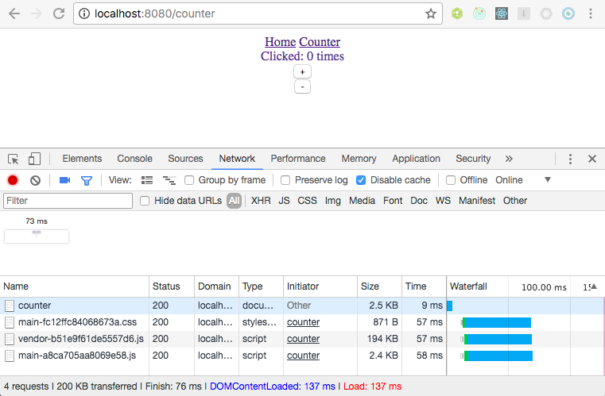

## Step 1: Setup and Tooling

_Use hops to create and run an initial application._

1. Make sure you have the following software installed

   * [node](https://nodejs.org)
   * [Yarn](https://yarnpkg.com/lang/en/docs/install/)

2. Create an initial project including malt frame using hops

   ```sh
   npx hops init my-hops-project
   ```

3. Start your project in development mode and open in browser under [localhost:8080](http://localhost:8080/).
   ```sh
   cd my-hops-project
   yarn start
   ```

## Step 2: Hot Reload

_Check out hot reloading._

1. Navigate to the `Counter` page using the top navigation

2. Change the state of the counter by clicking `+` and `-`, this updates Redux state

3. Locate and open `app.js` and change the name of the link `Counter` to `My Reloaded Counter`

4. When you save the file you will see the application reloaded while the counter state is pre-served

5. Rejoice if you ever tried to do this yourself and never quite made it to work :D

## Step 3: Build and Server Side Rendering

_Build your app for production and have a look at server side rendering._



1. Build your app for production

```sh
yarn build
```

2. Serve your app

```sh
yarn serve
```

3. Load your app into the browser and open developer tools, you should see something similar to the screenshot above

4. In Detail you see

* the first page impression is really fast as the page comes completely pre-rendered from the server (73ms)
* the site loads really quickly (137ms)
* there is no amount of additional rendering on the client side
* code is split into a vendor and an application bundle
* the vendor bundle can possibly be cached for more than one application, which is especially important for larger integrated ordinary web links
* you have single CSS file
* CSS is integrated into the production page so that it can render without executing any JavaScript

**This is especially attractive if you want to build an application that is takes care of professional aspects like SEO, Preview of Links, and Fast First-Page-Impression.**

## Step 4: Understanding Framework API

_Hops embraces de-facto-standards. It uses React Router v4, CSS Modules, and Redux._

```javascript
import React from 'react';
import { Route, Switch, Link } from 'react-router-dom';

import { render, Miss } from 'hops-react';
import { reduxExtension } from 'hops-redux';

import { Home } from './home';
import { Counter } from './counter';

import reducers from './reducers';

const App = () => (
  <div>
    <nav>
      <Link to="/">Home</Link>&nbsp;
      <Link to="/counter">Counter</Link>
    </nav>
    <Switch>
      <Route exact path="/" component={Home} />
      <Route exact path="/counter" component={Counter} />
      <Miss />
    </Switch>
  </div>
);

export default render(<App />, {
  extensions: [reduxExtension({ reducers })],
});
```

1. Your application is kicked-off by calling Hops' [`render function`](../packages/react/README.md##renderreactelement-config). Transparently, this will call different versions of `render` for client and server as different things need to be done.

```javascript
import { render } from 'hops-react';
export default render(<App />, ...);
```

2. As Hops is truly modular you can add extensions to this rendering process. Those extensions have influence both on the way your application is rendered both on client and server. In your app you use the a single extension `reduxExtension` exported from the `redux` package. You could, however, add as many extensions as you need and they can be combined in any way you like. There is more on [these concepts here](./concepts.md).

```javascript
import { render } from 'hops-react';
import { reduxExtension } from 'hops-redux';

import reducers from './reducers';

export default render(<App />, {
  extensions: [reduxExtension({ reducers })],
});
```

3. Hops uses React Router v4, but you do not need to wrap your application into Routers, as this is already done by Hops - again in a different in server and client. You just put `Route`s and `Link`s. `Miss` comes from Hops and allows the next express middleware to resolve a path not matched by your React application.

```javascript
import React from 'react';
import { Route, Switch, Link } from 'react-router-dom';

import { Miss } from 'hops-react';
import { reduxExtension } from 'hops-redux';

import { Home } from './home';
import { Counter } from './counter';

const App = () => (
  <div>
    <nav>
      <Link to="/">Home</Link>&nbsp;
      <Link to="/counter">Counter</Link>
    </nav>
    <Switch>
      <Route exact path="/" component={Home} />
      <Route exact path="/counter" component={Counter} />
      <Miss />
    </Switch>
  </div>
);
```

## Step 5: Run Tests

_Hops embraced Jest and Enzyme for testing. There is nothing special here._

1. Run tests

```sh
yarn test
```
