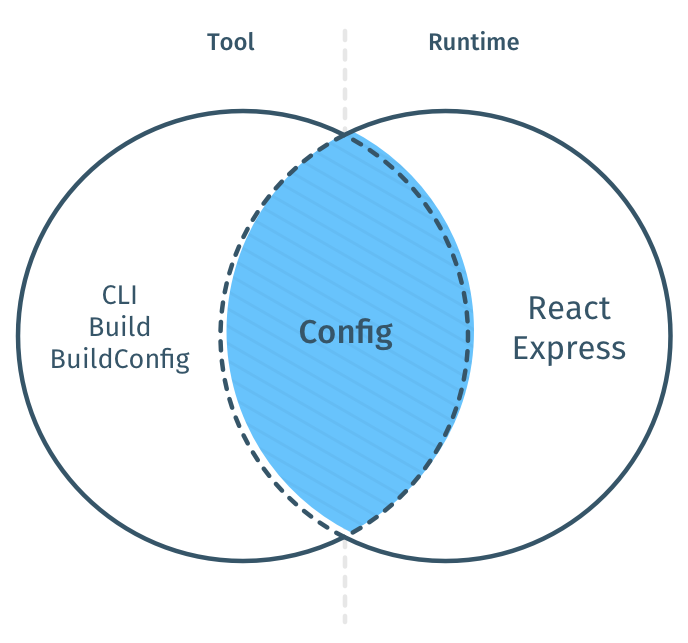

## Hops Core - Modules Overview

Hops can be split at least into the Tooling and the Runtime section. This is an idea of how the individual, non optional components look like:

## Modules Reference

When you first look at Hops you see the CLI project [Hops (CLI)](https://github.com/xing/hops/tree/master/packages/cli). This is what you might call the core of hops.

Hops is modular and its components are independently published on npm. Its main building blocks, however, rely upon each other:

| Package                                                                             | NPM                                                                                                           |
| ----------------------------------------------------------------------------------- | ------------------------------------------------------------------------------------------------------------- |
| [Hops (CLI)](https://github.com/xing/hops/tree/master/packages/cli)                 |                        |
| [Hops React](https://github.com/xing/hops/tree/master/packages/react)               |                |
| [Hops Redux](https://github.com/xing/hops/tree/master/packages/redux)               |                |
| [Hops GraphQL](https://github.com/xing/hops/tree/master/packages/graphql)           |            |
| [Hops Express](https://github.com/xing/hops/tree/master/packages/express)           |            |
| [Hops Lambda](https://github.com/xing/hops/tree/master/packages/lambda)             |              |
| [Hops Build](https://github.com/xing/hops/tree/master/packages/build)               |                |
| [Hops Config](https://github.com/xing/hops/tree/master/packages/config)             |              |
| [Hops Build Config](https://github.com/xing/hops/tree/master/packages/build-config) |  |
| [Hops Jest Preset](https://github.com/xing/hops/tree/master/packages/jest-preset)   |    |
