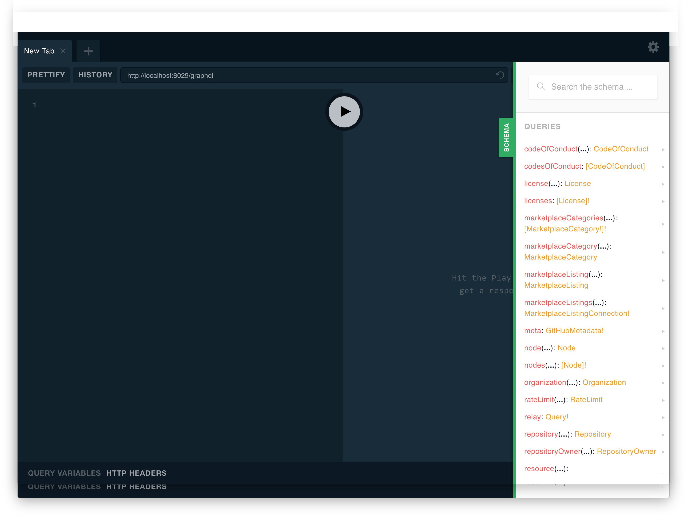

# `hops-graphql`

[](https://www.npmjs.com/package/hops-graphql)

**Please see the [main Hops Readme](../../DOCUMENTATION.md) for general information and a Getting Started Guide.**

This is a [preset for Hops](https://github.com/xing/hops/tree/master#presets) that can be used to set up an `<ApolloProvider />` and enable server-side and client-side support for GraphQL via the Apollo framework. Additionally it also brings an Apollo Server that can be used for mocking to enable faster local development.

### Installation

_This preset must be used together with the `hops-react` preset._

Add this preset and its peer dependencies `graphql-tag` and `react-apollo` to your existing Hops React project:

```bash
npm install --save hops-graphql graphql-tag react-apollo
```

If you don't already have an existing Hops project read this section [on how to set up your first Hops project.](https://github.com/xing/hops/tree/master#quick-start)

### CLI

#### `graphql introspect`

Extract information to support the `IntrospectionFragmentMatcher` from either a remote GraphQL server or from a local GraphQL schema file.

This preset takes care of setting up the Apollo cache and fragment matchers - if a `fragmentsFile` is present it will use the `IntrospectionFragmentMatcher`, otherwise it will fall back to a `HeuristicFragmentMatcher`.

This is not strictly necessary but is recommended if you have a more complex schema and are querying fragments on unions or interfaces.

Head over to https://github.com/apollographql/react-docs/blob/master/source/initialization.md#using-fragments-on-unions-and-interfaces to read more details about this.

##### Arguments

###### `-H` / `--header`

Pass additional HTTP headers that should be sent when executing the introspection query against a remote GraphQL server. For example when your server requires an authentication token or similar.

This argument can be specified multiple times to add multiple HTTP headers.

### Usage

#### Querying data on the client-side

In order to start using GraphQL in your application install this preset and configure the required options (see below).

Check out this [integration test](https://github.com/xing/hops/tree/master/packages/spec/integration/graphql) as an example for how to use this preset.

#### Creating custom mocks and stitching schemas using Apollo Server

When you are using GraphQL on client side to fetch and bind data into your UI components, it's quite often necessary to work with mock/stub data. There exists tons of feasible reasons why mocking makes sense in daily practices. In summary, the following seem to be the most important.

- GraphQL schema design in a Frontend-Driven approach
- Switching between local and remote query execution to work autonomously without an online GraphQL-Server access
- Faster execution of component integration test using local mock data sets
- Mock data set support to prove experimental/feature functionality thesis

You can enable mocking by configuring a file that exports an executable schema. Read more about [schema stitching](https://www.apollographql.com/docs/graphql-tools/schema-stitching.html) and check out [this blog post](https://blog.hasura.io/the-ultimate-guide-to-schema-stitching-in-graphql-f30178ac0072) for more examples.

**Supports Local GraphQL Playground against your GraphQL schema**

`open http://localhost:<port>/graphql`



### Configuration

#### Preset Options

| Name | Type | Default | Required | Description |
| --- | --- | --- | --- | --- |
| `fragmentsFile` | `String` | `<rootDir>/fragmentTypes.json` | _no_ | Where to store the generated fragment types file |
| `graphqlUri` | `String` | `''` | _yes_ | Url to your GraphQL endpoint or mock server |
| `graphqlSchemaFile` | `String` | `''` | _no_ | Path to your GraphQL schema file |
| `graphqlMockSchemaFile` | `String` | `''` | _no_ | Path to your GraphQL schema mocks |
| `graphqlMockServerPath` | `String` | `'/graphql'` | _no_ | Path of the mock server endpoint |
| `shouldPrefetchOnServer` | `Boolean` | `true` | _no_ | Whether Hops should execute GraphQL queries during server-side rendering |

##### `fragmentsFile`

This option controls where the fragment type information that are used for the `IntrospectionFragmentMatcher` should be saved.

By default executing `$ hops graphql introspect` will create a file called `fragmentTypes.json` in the application root directory.

```json
"hops": {
  "fragmentsFile": "<rootDir>/fragmentTypes.json"
}
```

##### `graphqlUri`

This is the full URI to your GraphQL endpoint which should be used by the client- and server-side when executing requests.

This will also be used to generate fragment type information with `$ hops graphql introspect` in case no [`graphqlSchemaFile`](#graphqlschemafile) has been provided.

```json
"hops": {
  "graphqlUri": "https://www.graphqlhub.com/graphql"
}
```

##### `graphqlSchemaFile`

In case your GraphQL server (configured via [`graphqlUri`](#graphqluri)) does not answer to introspection queries, you can provide the full schema as a file from which the introspection fragment matcher can generate information about unions and interfaces.

```json
"hops": {
  "graphqlSchemaFile": "<rootDir>/schema.graphql"
}
```

##### `graphqlMockSchemaFile`

Specify the path to your stitched mock schema, which is a file that exports an executable schema or a promise that resolves to an executable schema.

```json
{
  "hops": {
    "graphqlMockSchemaFile": "<rootDir>/graphql/index.js"
  }
}
```

**Example mock schema: `graphql/index.js`**

```javascript
import { makeExecutableSchema, addMockFunctionsToSchema } from 'graphql-tools';
import merge from 'lodash.merge';

import schema1 from './schema1.graphql';
import schema2 from './schema2.graphql';

import resolvers1 from './resolvers1';
import resolvers2 from './resolvers2';

const typeDefs = [schema1, schema2];

const resolvers = merge(resolvers1, resolvers2);

const mockSchema = makeExecutableSchema({
  typeDefs,
  resolvers,
});

addMockFunctionsToSchema({
  schema: mockSchema,
  mocks: {
    Date: () => '2017-10-17T13:06:22Z',
  },
  preserveResolvers: true,
});

export default mockSchema;
```

##### `shouldPrefetchOnServer`

Whether you want "full server-side rendering" or just "app shell" rendering.

This option controls whether you want Hops to execute GraphQL queries during server-side rendering, so that the actual components with actual data will get rendered (if set to false, Hops will not fetch data during server-side rendering).

```json
"hops": {
  "shouldPrefetchOnServer": false
}
```

#### Render Options

This preset has only a single runtime option which can be passed to the `render()` options inside the `styled` key (see example above).

| Name | Type | Default | Required | Description |
| --- | --- | --- | --- | --- |
| `graphql.link` | `ApolloLink` | `ApolloHttpLink` | _no_ | An instance of a `apollo-link` |
| `graphql.cache` | `ApolloCache` | `ApolloCacheInMemory` | _no_ | An instance of a `apollo-cache` |

##### `link`

By default this preset creates an `HttpLink` with the configured [`graphqlUri`](#graphqluri). If you need a different link, you can pass the instantiated link to the render options.

Read more about Apollo links here:

- https://www.apollographql.com/docs/link/
- https://www.apollographql.com/docs/react/advanced/network-layer.html

```javascript
export default render(<MyApp />, {
  graphql: { link: new HttpLink({ uri: 'http://api.githunt.com/graphql' }) },
});
```

##### `cache`

By default this preset creates an [`InMemoryCache`](https://www.apollographql.com/docs/react/advanced/caching.html) which uses either the [`IntrospectionFragmentMatcher` or `HeuristicFragmentMatcher`](https://www.apollographql.com/docs/react/advanced/fragments.html#fragment-matcher) depending on whether fragment introspection results are available or not (create them with [`$ hops graphql introspect`](#graphql-introspect)).

In case you need to configure a different Apollo cache you can pass an instantiated cache to the render options.

Read more about Apollo caches here: https://www.apollographql.com/docs/react/advanced/caching.html#configuration

```javascript
export default render(<MyApp />, {
  graphql: {
    cache: new InMemoryCache(),
  },
});
```

### Mixin Hooks API

**Caution**: Please be aware that the mixin hooks are not part of the SemVer API contract. This means that hook methods and signatures can change even in minor releases. Therefore it's up to you to make sure that all hooks that you are using in your own mixins still adhere to the new implementation after an upgrade of a Hops packages.

#### `getApolloLink(): ApolloLink` ([override](https://github.com/untool/mixinable/blob/master/README.md#defineoverride)) **runtime/browser/server**

Hook to return a custom [ApolloLink](https://github.com/apollographql/apollo-link).

Useful when the link needs access to the current request object, which only exists in the mixin context.

Beware that `link` passed as render option takes precedence.

#### `getApolloCache(): ApolloCache` ([override](https://github.com/untool/mixinable/blob/master/README.md#defineoverride)) **runtime/browser/server**

Hook to return a custom [ApolloCache](https://www.apollographql.com/docs/react/advanced/caching.html).

### `createFragmentMatcher` ([override](https://github.com/untool/mixinable/blob/master/README.md#defineoverride)) **runtime/browser/server**

Allows to get the [fragment matcher](https://www.apollographql.com/docs/react/advanced/fragments.html) that needs to be passed to the `ApolloCache`. Useful if you plan to override `getApolloCache`.

#### `canPrefetchOnServer(): boolean` ([sequence](https://github.com/untool/mixinable/blob/master/README.md#defineparallel)) **server**

This is a hook that can be used to customize the behavior of when Hops can prefetch data during server-side rendering. E.g. execute GraphQL queries during initial render. If any function of this sequence returns false it prevents server fetching for this request.

By default it returns whatever is configured in the [`shouldPrefetchOnServer` preset option](#shouldPrefetchOnServer).

In case you need more control over the server-side rendering you can implement this method and provide your own implementation that decides if data should be prefetched during server-side rendering.
