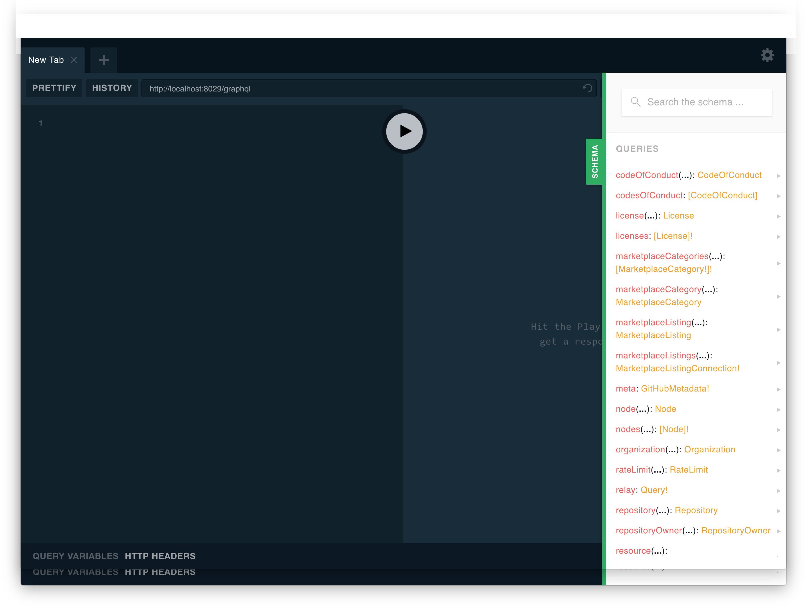

# GraphQL Mock Server

> Faster React component development using GraphQL Mock-Server (Apollo)

When you are using GraphQL on client side to fetch and bind data into your UI components, it's quite often necessary to work with mock/stub data. There exists tons of feasible reasons why mocking makes sense in daily practices. In summary, the following seem to be the most important.

- GraphQL schema design in a Frontend-Driven approach
- Switching between local and remote query execution to work autonomously without an online GraphQL-Server access
- Faster execution of component integration test using local mock data sets
- Mock data set support to prove experimental/feature functionality thesis

## Setup

**Install hops-graphql preset**

`yarn add hops-graphql`

**Start Hops development**

`hops start`

**Supports Local GraphQL Playground against your GraphQL schema**

`open http://localhost:<port>/graphql`



## Mock-Server Configuration

There are two combinable ways to configure the mock server.

- `remoteSchemas` - a list of remote GraphQL servers for which this mock server assumes a proxy role. When the mock server starts, the schema is downloaded from the url and exported as well. Additionally, you have the possibility to overwrite parts of the proxy schema with your own mock dataset resolvers.
- `localMocks` - a list of local GraphQL schemas to define your own GraphQL schemas and resolvers or extend an exisiting local or remote schema.

### Example

**`package.json`**

```json
{
  "hops": {
    "graphqlMockConfigFile": "<rootDir>/graphql-mock-config.js"
  }
}
```

**`graphql-mock-config.js`**

```javascript
module.exports = {
  remoteSchemas: [
    {
      url: 'https://api.github.com/graphql',
      headers: {
        Authorization: `bearer ${process.env.GITHUB_API_TOKEN}`,
      },
    },
  ],
  schemaMocks: ['./mocks/feature1', './mocks/feature2', './mocks/feature3'],
};
```

If you want to apply additional settings to the apollo middleware, you can do so with settings like these:

```js
module.exports = {
  remoteSchemas: [...],

  schemaMocks: [...],

  middlewareConfig: {
    cors: {
      credentials: true,
      origin: true,
      methods: 'GET,HEAD,PUT,PATCH,POST,DELETE',
      allowedHeaders: ['Content-Type', 'X-My-Special-Header'],
    },
  },
};
```

For all possible options, please see the [original apollo server documentation section](https://www.apollographql.com/docs/apollo-server/api/apollo-server.html#ApolloServer-applyMiddleware).

## GraphQL Mock-Server usage examples

- [Define your own schema extentions](#define-your-own-schema-extentions)
- [Use a remote schema as a proxy](#use-a-remote-schema-as-a-proxy)
- [Overwrite remote data using custom resolver](#overwrite-remote-data-using-custom-resolver)
- [Extend a schema and attach custom resolver](#extend-a-schema-and-attach-custom-resolver)
- [Define and mock scalar, interface, union and enum types](#define-and-mock-scalar-interface-union-and-enum-types)
- [Define and mock mutations with success and error fields](#define-and-mock-mutations-with-success-and-error-fields)
- [Define and mock cursor-based pagination with connection and edges](#define-and-mock-cursor-based-pagination-with-connection-and-edges)

## Define your own schema extentions

To define your own schema extentions it is necessary to stick to a few conventions. Every schema extention should be summarized to a closed feature based bundle in shape of a folder. In this case we call it feature. Every feature folder can contain

- `schema.graphql` - to crate or extend a schema using the schema definition language [SDL](https://facebook.github.io/graphql/)
- `resolvers.js` - to implement dataset resolvers using NodeJS
- `mock.js` - to implement mock datasets based on types

It's required to configure your schema extentions and dataset resolvers in the correct order. The reason for this is quite simple. Sometimes a type depends on a type from a different schema file or on a type from a remote schema.

**`package.json`**

```json
{
  "hops": {
    "graphqlMockConfigFile": "<rootDir>/graphql-mock-config.js"
  }
}
```

**`graphql-mock-config.js`**

```javascript
module.exports = {
  remoteSchemas: [],
  schemaMocks: ['./mocks/feature1', './mocks/feature2', './mocks/feature3'],
};
```

## Use a remote schema as a proxy

You can configure one or more GraphQL server URLs to merge them together to a larger schema (also known as [schema stitching](https://www.apollographql.com/docs/graphql-tools/schema-stitching.html)).

**`package.json`**

```json
{
  "hops": {
    "graphqlMockConfigFile": "<rootDir>/graphql-mock-config.js"
  }
}
```

**`graphql-mock-config.js`**

````javascript
module.exports = {
  remoteSchemas: [
    {
      url: 'https://api.github.com/graphql',
      headers: {
        Authorization: 'bearer <YOUR GITHUB API TOKEN>',
      },
    },
  ],
  schemaMocks: ['./mocks/feature1', './mocks/feature2', './mocks/feature3'],
};

    ```

**Example query**

```graphql
{
  viewer {
    name
  }
}
````

**Example response**

```json
{
  "viewer": {
    "name": "Max Mustermann"
  }
}
```

## Overwrite remote data using custom resolver

**Examples**

- [Custom field resolver](../../spec/integration/graphql-mock-server/mocks/exercise1)

## Extend a schema and attach custom resolver

**Examples**

- [Extend Query Type](../../spec/integration/graphql-mock-server/mocks/exercise2)
- [Usage of interface](../../spec/integration/graphql-mock-server/mocks/exercise3)

## Define and mock scalar, interface, union and enum types

- [Mock scalar values](../../spec/integration/graphql-mock-server/mocks/exercise4)
- [Mock interface types](../../spec/integration/graphql-mock-server/mocks/exercise5)
- [Mock union types](../../spec/integration/graphql-mock-server/mocks/exercise6)
- [Mock enums](../../spec/integration/graphql-mock-server/mocks/exercise7)

## Define and mock mutations with success and error fields

- [Mock mutations with success and error fields](../../spec/integration/graphql-mock-server/mocks/exercise8)

## Define and mock cursor-based pagination with connection and edges

- [Cursor-based pagination with connection and edges](../../spec/integration/graphql-mock-server/mocks/exercise9)
